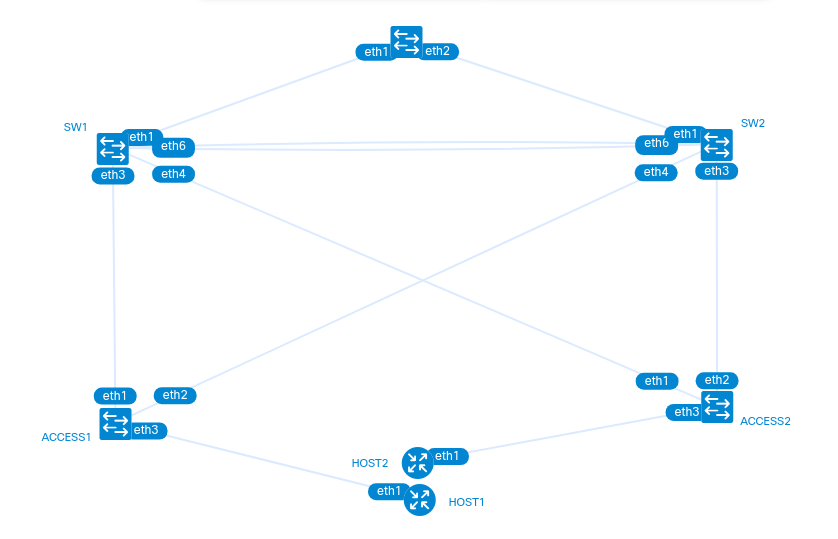

# Campus Lab: Core, Distribution, and Access Layers with Automation

This project demonstrates a multi-vendor campus network design using [Containerlab](https://containerlab.dev/), featuring a three-tier architecture (Core, Distribution, Access) and network automation scripts.



The lab includes:

- **Core Layer**: A Cisco IOL router (`RTR`) providing routing and external connectivity.
- **Distribution Layer**: Two Arista cEOS devices (`SW1`, `SW2`) configured for inter-VLAN routing with VRRP for redundancy, and OSPF for routing with the core.
- **Access Layer**: Two Cisco IOL switches (`ACCESS1`, `ACCESS2`) providing host connectivity and VLAN assignment.
- **Hosts**: Two Linux Alpine hosts (`HOST1`, `HOST2`) connected to different VLANs.
- **Automation Scripts**: Python scripts for connectivity testing, SNMP configuration, and SNMP data retrieval using `Nornir`, `Netmiko`, and `pysnmp`.

### Nodes:

| Name    | Type         | Role                                     | Management IP    |
| ------- | ------------ | ---------------------------------------- | ---------------- |
| RTR     | Cisco IOL    | Core Router (OSPF, Default Route)        | `192.168.122.10` |
| SW1     | Arista cEOS  | Distribution Switch (OSPF, VRRP Primary) | `192.168.122.11` |
| SW2     | Arista cEOS  | Distribution Switch (OSPF, VRRP Backup)  | `192.168.122.12` |
| ACCESS1 | Cisco IOL L2 | Access Switch (VLAN 10)                  | `192.168.122.21` |
| ACCESS2 | Cisco IOL L2 | Access Switch (VLAN 20)                  | `192.168.122.22` |
| HOST1   | Linux Alpine | Client Host (VLAN 10)                    | `192.168.122.29` |
| HOST2   | Linux Alpine | Client Host (VLAN 20)                    | `192.168.122.30` |

## 📁 Files

- `lab.clab.yaml` – Containerlab topology definition.
- `configs/` – Directory containing initial configuration files for all network devices.
  - `rtr.ios`
  - `sw1.ios`
  - `sw2.ios`
  - `access1.ios`
  - `access2.ios`
- `scripts/` – Directory containing Python automation scripts.
  - `test_connection.py` – Verifies device reachability and interface status using Nornir/Netmiko.
  - `enable_snmp.py` – Configures SNMP on Cisco IOS devices using Netmiko.
  - `snmp-get.py` – Retrieves SNMP data (e.g., `sysDescr`) using pysnmp.
  - `fetch_configs.py` – (Not detailed, but likely fetches configurations)
  - `push_configs.py` – (Not detailed, but likely pushes configurations)
  - `snmp_multiple_oid.py` – (Not detailed, but likely retrieves multiple SNMP OIDs)
- `config.yaml` – Nornir inventory configuration.
- `requirements.txt` – Python dependencies for automation scripts.
- `lab.png` – Network topology diagram.

## ⚙️ Configuration Highlights

### Core Router (RTR - Cisco IOL)
- OSPF routing enabled.
- Links to distribution switches (`SW1`, `SW2`) are routed interfaces (`10.1.1.1/30`, `10.1.2.1/30`).
- Default route originated.

### Distribution Switches (SW1, SW2 - Arista cEOS)
- OSPF routing enabled, peering with `RTR`.
- VRRP configured for redundant gateways for VLAN 10 (`10.10.10.1`) and VLAN 20 (`10.20.20.1`).
  - `SW1` is VRRP primary for VLAN 10, secondary for VLAN 20.
  - `SW2` is VRRP primary for VLAN 20, secondary for VLAN 10.
- Links to access switches (`ACCESS1`, `ACCESS2`) are trunk ports.
- API management (HTTP-commands, gNMI, NETCONF) enabled.

### Access Switches (ACCESS1, ACCESS2 - Cisco IOL L2)
- `ACCESS1` provides access for VLAN 10 (`HOST1`).
- `ACCESS2` provides access for VLAN 20 (`HOST2`).
- Redundant trunk links to distribution switches.

### Hosts (HOST1, HOST2 - Linux Alpine)
- `HOST1` (VLAN 10) IP: `10.10.10.100/24`, Gateway: `10.10.10.1`.
- `HOST2` (VLAN 20) IP: `10.20.20.100/24`, Gateway: `10.20.20.1`.

## 🚀 How to Run

> Prerequisites: [Containerlab](https://containerlab.dev/) and required images (`vrnetlab/cisco_iol`, `ceos`, `alpine`). Python with `nornir`, `netmiko`, `pysnmp` installed (from `requirements.txt`).

1. Clone this repository:

   ```bash
   git clone <your-repo-url>
   cd campus-lab
   ```

2. Install Python dependencies:

   ```bash
   pip install -r requirements.txt
   ```

3. Deploy the lab:

   ```bash
   sudo containerlab deploy -t lab.clab.yaml
   ```

4. Copy initial configurations to devices (Containerlab handles this automatically if `configs/` is present and named correctly).

5. Run automation scripts:

   ```bash
   python3 scripts/test_connection.py
   python3 scripts/enable_snmp.py
   python3 scripts/snmp-get.py
   ```

## 🧪 Testing

1. **Verify basic connectivity**:
   Run `python3 scripts/test_connection.py` to check ICMP reachability and interface status.

2. **Test inter-VLAN routing**:
   From `HOST1` (VLAN 10):
   ```bash
   ping 10.20.20.100 # Ping HOST2
   ping 10.10.10.1   # Ping VLAN 10 Gateway
   ping 10.20.20.1   # Ping VLAN 20 Gateway
   ```
   From `HOST2` (VLAN 20):
   ```bash
   ping 10.10.10.100 # Ping HOST1
   ping 10.20.20.1   # Ping VLAN 20 Gateway
   ping 10.10.10.1   # Ping VLAN 10 Gateway
   ```

3. **Verify SNMP**:
   After running `enable_snmp.py`, execute `python3 scripts/snmp-get.py` to retrieve `sysDescr` from `RTR`.

## 🧹 Cleanup

```bash
sudo containerlab destroy -t lab.clab.yaml
```

## 📌 Notes

* The lab uses `virbr0` for management network.
* VRRP is configured for active/standby gateway redundancy at the distribution layer.
* OSPF is used for routing between the core and distribution layers.
* The automation scripts demonstrate basic network programmability with Python.

---

## 📎 License

This project is open-sourced for educational use. No official affiliation with Cisco or Arista.
